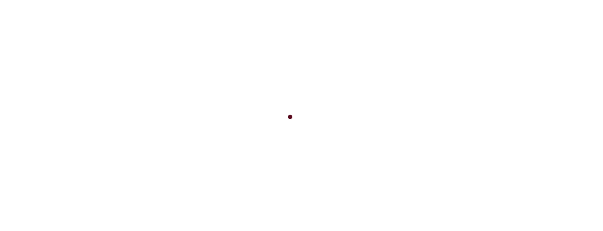
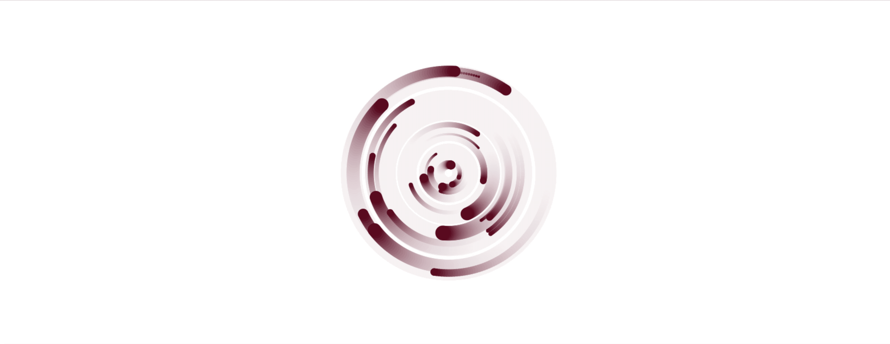

# Je fais des ronds

> A JS exercise use at HEPL for MMI.

* * *

**circular** is an educational project, which will be used for `JS` courses.

**Note:** the school where the course is given, the [HEPL](https://hepl.be) from Liège, Belgium, is a French-speaking school. From this point, the instruction will be in French. Sorry.

* * *

## Énoncé

Une version du projet se trouve [ici](https://hepl-mmi.github.io/circular)

1. Commencez par dessiner un cercle. Celui-ci se déplace régulièrement sur l'axe des `x` en allant de la gauche vers la droite. Vous devez mettre à jour sa position en `x`, dans un premier temps. Pour déterminer cette position, commencez par choisir une ouverture d’angle exprimée en radians (de 0 à `2*PI`). Incrémentez cette valeur à chaque nouveau calcul du canvas avec une valeur constante. Cette quantité constante que vous ajoutez doit être assez petite. Par exemple  `0.025`. Servez-vous de ce radian, que vous mettez à jour, pour retrouver son [cosinus](https://developer.mozilla.org/fr/docs/Web/JavaScript/Reference/Global_Objects/Math/cos), cette valeur deviendra la nouvelle position en `x` du cercle. Pensez à ajouter cette nouvelle valeur à partir du centre du canvas.  Pour augmenter l'effet de déplacement, ajoutez un multiplicateur pour que la distance parcourue soit plus importante.
2. Appliquez le même traitement pour la position `y` afin de dessiner un cercle.
3. Définissez aléatoirement le multiplicateur que vous appliquez à votre formule. Ainsi la distance qui sépare le cercle du centre du canvas change.  Générez plusieurs cercles.
4. Maintenant, à la place d'effacer le canvas, dans votre boucle d'animation, dessinez un rectangle blanc avec une certaine transparence. 
5. Générez des couleurs aléatoires pour chaque cercle. Il est intéressant de travailler avec une palette de couleurs HSL. Ainsi vous choisissez une couleur au démarrage et vous générez des nuances à partir de cette couleur de référence, afin d'avoir un camaïeu. 
5. Enfin, mettez à jour le centre au déplacement de la souris. Actuellement, vous calculez le centre uniquement à partir de la taille du canvas, prenez maintenant comme référence la position de la souris.
